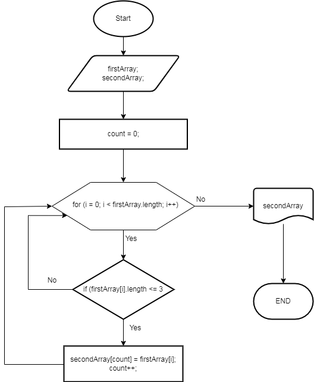

 *Дана задача: Написать программу, которая из имеющегося массива строк формирует новый массив из строк, длина которых меньше, либо равна 3 символам. Первоначальный массив можно ввести с клавиатуры, либо задать на старте выполнения алгоритма. При решении не рекомендуется пользоваться коллекциями, лучше обойтись исключительно массивами.*

*Примеры:*

*[“Hello”, “2”, “world”, “:-)”] > [“2”, “:-)”]*

*[“1234”, “1567”, “-2”, “computer science”] > [“-2”]*

*[“Russia”, “Denmark”, “Kazan”] > []*
___
# Алгоритм:

---
# Краткое описание алгоритма:

### 1) Создается два массива: в первый заносятся данные извне, второй пустой с той же длиной как первый;
### 2) Вводим переменную count = 0 в качестве индексов для элементов второго массива;
### 3) Запускаем цикл от 0 до размера длины первого массива с увеличением на 1, в котором выполняется условие "Элемент первого массива меньше либо равен 3?":
### - Если да, то присваиваем его в count элемент второго массива и увеличиваем count на 1 и продолжаем цикл.
### - Если нет, то продолжаем цикл.
### 4) Цикл продолжается до тех пор пока не проверятся все элементы из первого массиваж
### 5) Вывод на экран полученного второго массива.
### *p/s: визуализация алгоритма представлена в файле __[Algoritm.png](Algoritm/Algoritm.png)__ размещнном в папке __Algoritm__*

---
# Описание реализованной программы:

### 1) Создается извне строковый массив firstArray (со случайной длиной от 1 до 10) с помощью функции ReadArray;
### 2) Вывод на экран в качестве промежуточной визуализации введенного массива firstArray с помощью функции WriteArray;
### 3) Создается строковый массив secondArray с такой же длиной как и массив firstArray с помощью функции NewArrayByElementLengh
### 4) Вывод на экран полученного массива secondArray с помощью функции WriteArray;

## Описание функции NewArrayByElementLengh
### 1) В качестве исходных данных задается строковый исходный массив (arr) и требуемая "длина элемента";
### 2) Создается второй строковый массив (newArray) равный по длине массива arr;
### 3) Вводим переменную count = 0 в качестве индексов для элементов второго массива;
### 4) Далее запускается цикл for  i от 0 до размера длины исходного массива с увеличением на 1, в котором выполняется условие If "Элемент первого массива меньше либо равен "длина элемента"?":
 ### - Если да, то i-тый элемент массива arr присваивается в count элемент массива newArray и увеличивается count на 1 и продолжается цикл.
 ### - Если нет, то продолжается цикл.
### 4) Цикл продолжается до тех пор пока не проверятся все элементы из первого массива.
### 5) Меняется размер массива newArray до размера равному count.
### 6) Возращается массив newArray.

### *p/s: данная программа реализованна в файле __Program.cs__ в папке __Task__.*